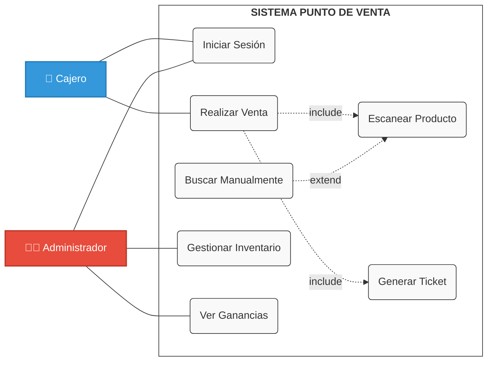

# Etapa 1: Análisis

## Proyecto: Sistema de Punto de Venta (POS) "Los Dos Hermanos"

## Introducción
La tienda de abarrotes **"Los Dos Hermanos"** actualmente gestiona sus ventas y control de inventario de forma manual, basándose en la memoria del dueño, anotaciones en libreta y uso de calculadora básica. Esto ha generado lentitud en el cobro, errores en el cálculo de cambio, desconocimiento de las ganancias reales y falta de control sobre el stock.

## Entrevista Inicial

**Estudiante :**
Buenos días, soy estudiante de ISC en el Tecnológico de Motul y como parte de mi proyecto en la materia de Ingeniería en Software vengo a hablar de las dificultades que usted tenga a la hora de administrar su tienda de abarrotes.

**Cliente (Dueño de la tienda):**
Adelante, joven.

**Estudiante :**
¿Qué es lo que más se le dificulta en la tienda?

**Cliente (Dueño de la tienda):**
Bueno, lo principal es que quiero automatizar el proceso de venta, ya que actualmente me cuesta trabajo registrar los productos con sus costos y precios de venta. También se me complica el cobro, necesito que el cálculo de totales sea automático a medida que agrego productos para no tardar, y al final del día me gustaría poder generar reportes de cierre de caja con el cálculo de mis ganancias, cosa que ahora no puedo hacer bien.

**Estudiante :**
Bueno tomando en cuenta lo que me dijo, ¿qué le parece una aplicación de Sistema de Punto de Venta (POS) que le permita realizar ventas mediante el escaneo de códigos de barras y busque automáticamente el producto en la base de datos?

**Cliente (Dueño de la tienda):**
La verdad es justo lo que necesito. Si esa aplicación puede hacer las sumas solita y decirme el precio nada más pasando el producto, me quitaría un gran peso de encima. Así ya no tendría que estar batallando con la calculadora ni preocupándome por si cobré mal.

# Levantamiento de Requerimientos

### Optimizar el proceso de ventas
- Búsqueda rápida de precios (escáner/nombre)
- Cálculo automático de totales
- Cálculo de cambio a entregar
- Visualización clara de precios en pantalla
- Cancelación rápida de artículos
- Generación de ticket de venta

###  Organización de inventario
- Registro de productos (Alta y Baja)
- Registro de cantidad inicial
- Búsqueda de producto por nombre
- Descuento automático de stock tras venta
- Visualización de "cuánto hay" en tiempo real
- Alertas de baja disponibilidad ("cuánto queda")
- Reporte de productos agotados

###  Control de administración y seguridad
- Perfiles de acceso (Administrador vs Cajero)
- Restricción de cambio de precios
- Cortes de caja diarios
- Funcionamiento sin internet (Offline)
- Historial de transacciones
---

## Justificación
La implementación de este sistema se justifica como una solución tecnológica urgente para automatizar los procesos operativos. 

El software logrará:
1.  Eliminar la dependencia de la memoria del personal.
2.  Garantizar la exactitud matemática en los cobros.
3.  Proporcionar datos reales sobre el stock.
4.  Transformar la operación de la tienda en un modelo eficiente y seguro.

---
**Objetivo del estudio:**
Determinar la viabilidad del desarrollo e implementación de un software de escritorio a medida para automatizar el proceso de venta y control de existencias.

##  Descripción del Proyecto
* **Nombre del software:** POS Los Dos Hermanos v1.0
* **Propósito:** Automatizar el cobro de productos mediante lectura de códigos de barras, gestionar el inventario (entradas y salidas) y generar reportes financieros.
* **Usuarios:**
    * **Cajero:** Encargado de ventas (Usuario operativo).
    * **Administrador:** Dueño (Acceso total a inventario y reportes).

**Alcance:**
* Módulo de Login (Seguridad).
* Ventas rápidas con escáner.
* Búsqueda manual de productos.
* Gestión de Inventario (Altas/Bajas).
* Reporte de corte de caja.

---

##  Análisis de Factibilidad

### 3.1 Factibilidad Técnica
El proyecto se desarrollará utilizando tecnologías de licencia gratuita y estándar en la industria.

**Tecnologías a utilizar:**
* **Lenguaje:** Java (JDK 17+).
* **IDE:** NetBeans.
* **Base de Datos:** MySQL (Server 8.0).
* **Interfaz:** Java Swing (Escritorio).
* **Arquitectura:** Local (Standalone).

**Recursos:**
* **Humanos:** 1 Desarrollador (Estudiante de Ingeniería en Software).
* **Hardware:** Equipo de cómputo para desarrollo y PC de escritorio en tienda (existente).
* **Periféricos:** Lector de códigos de barras USB.

### Factibilidad Operativa
Análisis de la adopción del sistema por parte de los usuarios finales.

* **Resistencia al cambio:** El dueño solicitó explícitamente automatizar las sumas y precios para reducir la carga mental.
* **Capacitación:** Se requiere una interfaz intuitiva que permita operar el sistema con menos de 1 hora de entrenamiento.
* **Impacto en Procesos:** Se estima una reducción en el tiempo de atención al cliente de 3 minutos a 45 segundos por transacción.
## 3. Objetivos del Proyecto

### Requerimientos Funcionales

| ID Requisito | Requisito | Descripción de requisito | Negocio/Necesidad/oportunidad/objetivo | ¿Quién lo solicita? | Rol/Departamento | Entregable | Casos de prueba | Estado | Comentarios |
| :--- | :--- | :--- | :--- | :--- | :--- | :--- | :--- | :--- | :--- |
| **RF01** | Lectura de Códigos | Recibir entrada de lector de código de barras y buscar automáticamente el producto en BD. | Agilizar el proceso de venta y reducir errores humanos. | Tienda Abarrotes | Cajero | 1.0 | Testing | Pendiente | Integración con hardware de escáner. |
| **RF02** | Recuperación de Precios | Mostrar inmediatamente descripción y precio de venta en la lista al escanear. | Validar visualmente el producto y precio ante el cliente. | Tienda Abarrotes | Cajero | 1.0 | Testing | Pendiente | Debe coincidir con la BD. |
| **RF03** | Cálculo de Totales | Sumar automáticamente el total de la venta conforme se agregan productos. | Automatizar el cobro y evitar cálculos manuales. | Tienda Abarrotes | Cajero | 1.0 | Testing | Pendiente | Actualización en tiempo real. |
| **RF04** | Gestión de Productos | Permitir Agregar, Editar y Eliminar productos del inventario. | Mantener el catálogo y precios actualizados. | Tienda Abarrotes | Administrador | 1.1 | Testing | Pendiente | Campos: Código, Nombre, Costo, P. Venta. |
| **RF05** | Registro de Ventas | Guardar cada venta finalizada en el historial con fecha y hora exacta. | Trazabilidad y seguridad de las transacciones. | Tienda Abarrotes | Sistema / Gerencia | 1.1 | Testing | Pendiente | Registro histórico inmutable. |
| **RF06** | Reporte de Ganancias | Generar reporte diario mostrando el "Total Vendido" (
### Requerimientos No Funcionales

| ID Requisito | Requisito | Descripción de requisito | Negocio/Necesidad/oportunidad/objetivo | ¿Quién lo solicita? | Rol/Departamento | Entregable | Casos de prueba | Estado | Comentarios |
| :--- | :--- | :--- | :--- | :--- | :--- | :--- | :--- | :--- | :--- |
| **RNF01** | Usabilidad (Interfaz) | Interfaz intuitiva optimizada para teclado y escáner, minimizando uso del mouse. | Velocidad operativa en momentos de alta afluencia (evitar colas). | Tienda Abarrotes | Todos los usuarios | 1.0 | Prueba de Usabilidad | Pendiente | Diseño "Keyboard-first". |
| **RNF02** | Rendimiento (Velocidad) | La búsqueda del producto tras el escaneo no debe tardar más de 1 segundo. | Eficiencia en el servicio al cliente. | Tienda Abarrotes | Sistema | 1.0 | Prueba de Carga | Pendiente | Optimización de consultas SQL. |
| **RNF03** | Persistencia (Datos) | Almacenamiento en BD local (MySQL) para asegurar datos al cerrar el programa. | Seguridad de la información y prevención de pérdida de datos. | Tienda Abarrotes | Sistema / TI | 1.0 | Prueba de Recuperación | Pendiente | Configuración de MySQL Local. |
| **RNF04** | Seguridad (Control de Acceso) | Restringir el acceso al módulo de "Gestión de Productos" mediante usuario/contraseña. | **Prevención de fraude:** Evitar que cajeros modifiquen precios sin autorización. | Tienda Abarrotes | Administrador | 1.1 | Prueba de Seguridad | Pendiente | Roles: Admin vs. Cajero. |
| **RNF05** | Fiabilidad (Manejo de Errores) | El sistema debe mostrar alertas claras si un código no existe, sin cerrarse ni bloquearse. | **Continuidad operativa:** Asegurar que la venta continúe aunque haya errores de lectura. | Tienda Abarrotes | Cajero | 1.0 | Prueba de Excepciones | Pendiente | Validar entradas nulas o incorrectas. |

---
# Matriz de trazabilidad

|  ID |  Requisito |  Descripción |  Estado |  Etiquetas |
| :--- | :--- | :--- | :--- | :--- |
| **RF-01** | **Iniciar Sesión** | Pantalla de acceso (Login) que solicite Usuario y Contraseña. Bloqueo tras 3 intentos fallidos. | `🔘 Sin empezar` | `Seguridad` `Prioridad Alta` |
| **RF-02** | **Gestión de Usuarios** | Módulo para que el Admin pueda crear, editar y borrar cuentas de cajeros. | `🔘 Sin empezar` | `Admin` `Seguridad` |
| **RF-03** | **Validación de Roles** | El sistema debe diferenciar permisos: "Admin" (Acceso total) vs "Cajero" (Solo ventas). | `🔘 Sin empezar` | `Seguridad` `Backend` |
| **RF-04** | **Cerrar Sesión** | Función para desconectar al usuario actual y volver a la pantalla de Login sin cerrar el software. | `🔘 Sin empezar` | `Seguridad` |
| **RF-05** | **Registrar Producto** | Formulario para dar de alta productos con: Código, Nombre, Costo, Precio y Stock Inicial. | `🔘 Sin empezar` | `Inventario` `Admin` |
| **RF-06** | **Entrada de Mercancía** | Función para sumar stock a un producto existente (resurtido) sin borrarlo. | `🔘 Sin empezar` | `Inventario` `Admin` |
| **RF-07** | **Editar Producto** | Permitir modificar precios, costos o nombres de productos ya registrados. | `🔘 Sin empezar` | `Inventario` `Admin` |
| **RF-08** | **Eliminar Producto** | Dar de baja lógica un producto del catálogo que ya no se vende. | `🔘 Sin empezar` | `Inventario` `Admin` |
| **RF-09** | **Consultar Inventario** | Vista de tabla con todos los productos, precios y existencias actuales. | `🔘 Sin empezar` | `Inventario` `Admin` |
| **RF-10** | **Lectura de Códigos** | Integración con lector de código de barras para entrada automática de productos. | `🔘 Sin empezar` | `Ventas` `Hardware` |
| **RF-11** | **Búsqueda Manual** | Buscador por nombre de producto (para casos donde el código no lee). | `🔘 Sin empezar` | `Ventas` `Usabilidad` |
| **RF-12** | **Recuperación de Precios** | Mostrar descripción y precio en pantalla en < 1 seg al escanear (Resuelve: "No saberse los precios"). | `🔘 Sin empezar` | `Ventas` `Backend` |
| **RF-13** | **Agregar a Venta** | Añadir el producto escaneado a la lista de compra actual en pantalla. | `🔘 Sin empezar` | `Ventas` |
| **RF-14** | **Cálculo de Subtotal** | Suma automática de importes en tiempo real. (Resuelve: Cálculo manual). | `🔘 Sin empezar` | `Ventas` |
| **RF-15** | **Eliminar Ítem Venta** | Opción para quitar un producto de la lista antes de cobrar. | `🔘 Sin empezar` | `Ventas` |
| **RF-16** | **Cobro y Cambio** | Calculadora integrada: Ingresar monto recibido y mostrar cambio exacto. (Resuelve: "Problemas con calculadora"). | `🔘 Sin empezar` | `Ventas` `Usabilidad` |
| **RF-17** | **Finalizar Venta** | Guardar transacción en BD y descontar stock automáticamente. | `🔘 Sin empezar` | `Ventas` `Base de Datos` |
| **RF-18** | **Generar Ticket** | Generación de comprobante de venta con folio, fecha y detalle. | `🔘 Sin empezar` | `Ventas` `Reportes` |
| **RF-19** | **Cancelar Venta** | Botón para limpiar toda la operación actual sin guardar cambios. | `🔘 Sin empezar` | `Ventas` |
| **RF-20** | **Registro Histórico** | Guardado interno de fecha, hora y detalles de cada venta cerrada. | `🔘 Sin empezar` | `Base de Datos` |
| **RF-21** | **Reporte de Ventas** | Vista de "Corte de Caja" con el total de dinero ingresado en el día. | `🔘 Sin empezar` | `Reportes` `Gerencia` |
| **RF-22** | **Reporte de Ganancias** | Cálculo automático de utilidad (Venta - Costo) del día. | `🔘 Sin empezar` | `Reportes` `Gerencia` |
| **RNF-01** | **Usabilidad** | Interfaz optimizada para uso con teclado (atajos) y escáner. | `🔘 Sin empezar` | `No Funcional` `UX` |
| **RNF-02** | **Rendimiento** | Respuestas del sistema en menos de 1 segundo por escaneo. | `🔘 Sin empezar` | `No Funcional` `Performance` |
| **RNF-03** | **Persistencia** | Uso de Base de Datos local (MySQL) para evitar pérdida de datos. | `🔘 Sin empezar` | `No Funcional` `Infraestructura` |
| **RNF-04** | **Seguridad** | Encriptación de contraseñas y protección de módulos administrativos. | `🔘 Sin empezar` | `No Funcional` `Seguridad` |
| **RNF-05** | **Fiabilidad** | Manejo de errores (el sistema no se cierra si falla una lectura). | `🔘 Sin empezar` | `No Funcional` `Calidad` |

## Estimación de Costos (Fase de Desarrollo)

| Categoría | Concepto / Recurso | Descripción y Uso en el Proyecto | Costo Estimado |
| :--- | :--- | :--- | :--- |
| **Hardware** | Lector de Código de Barras | Escáner USB económico para pruebas de desarrollo (eventos de teclado/KeyListeners). | $ 300.00 |
| **Software** | Entorno de Desarrollo (IDE) | NetBeans, Eclipse o IntelliJ IDEA (Community) para escribir el código Java. | $ 0.00 |
| **Software** | Gestor de Base de Datos | MySQL Server + Workbench para diseñar tablas y hacer pruebas locales. | $ 0.00 |
| **Software** | Java Development Kit (JDK) | Librerías y compilador de Java necesarios para el desarrollo. | $ 0.00 |
| **Software** | Control de Versiones | Git y GitHub para el alojamiento del código fuente y control de versiones. | $ 0.00 |
| **Software** | Diseño UI/UX | Figma, Balsamiq o similar (nivel gratuito) para el prototipado de interfaces. | $ 0.00 |
| **Recursos Humanos** | Horas de Desarrollo | Tiempo invertido en: Análisis, Diseño, Programación y Pruebas. | $ 0.00 |
| **Servicios** | Internet y Electricidad | Proporcional de consumo durante las semanas de desarrollo. | $ 0.00 |
| | | **TOTAL ESTIMADO DE DESARROLLO:** | **$ 0.00** |

# Etapa 2: Diseño

*(Aquí puedes añadir la estructura de tus tablas de SQL o el diseño de las ventanas de Java)*
