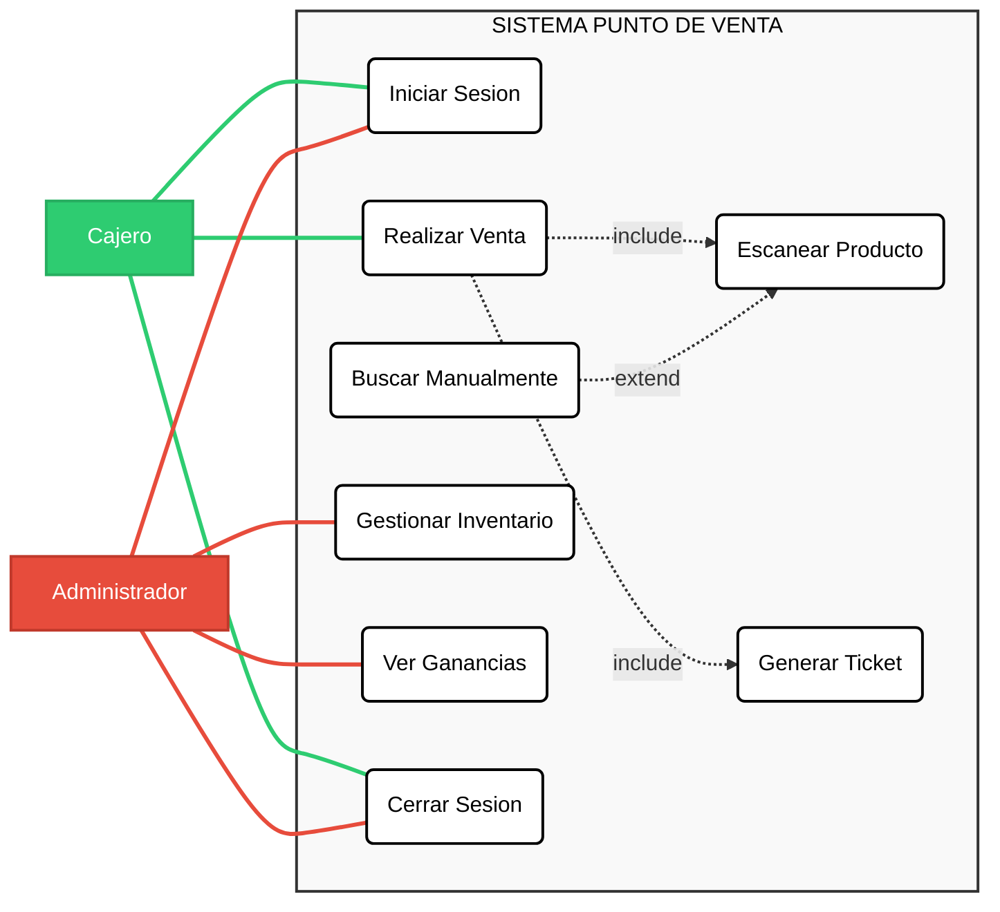

---
**Objetivo del estudio:**
Determinar la viabilidad del desarrollo e implementación de un software de escritorio a medida para automatizar el proceso de venta y control de existencias.

##  Descripción del Proyecto
* **Nombre del software:** POS Los Dos Hermanos v1.0
* **Propósito:** Automatizar el cobro de productos mediante lectura de códigos de barras, gestionar el inventario (entradas y salidas) y generar reportes financieros.
* **Usuarios:**
    * **Cajero:** Encargado de ventas (Usuario operativo).
    * **Administrador:** Dueño (Acceso total a inventario y reportes).

**Alcance:**
* Módulo de Login (Seguridad).
* Ventas rápidas con escáner.
* Búsqueda manual de productos.
* Gestión de Inventario (Altas/Bajas).
* Reporte de corte de caja.

---

##  Análisis de Factibilidad

### 3.1 Factibilidad Técnica
El proyecto se desarrollará utilizando tecnologías de licencia gratuita y estándar en la industria.

**Tecnologías a utilizar:**
* **Lenguaje:** Java (JDK 17+).
* **IDE:** NetBeans.
* **Base de Datos:** MySQL (Server 8.0).
* **Interfaz:** Java Swing (Escritorio).
* **Arquitectura:** Local (Standalone).

**Recursos:**
* **Humanos:** 1 Desarrollador (Estudiante de Ingeniería en Software).
* **Hardware:** Equipo de cómputo para desarrollo y PC de escritorio en tienda (existente).
* **Periféricos:** Lector de códigos de barras USB.

### Factibilidad Operativa
Análisis de la adopción del sistema por parte de los usuarios finales.

* **Resistencia al cambio:** El dueño solicitó explícitamente automatizar las sumas y precios para reducir la carga mental.
* **Capacitación:** Se requiere una interfaz intuitiva que permita operar el sistema con menos de 1 hora de entrenamiento.
* **Impacto en Procesos:** Se estima una reducción en el tiempo de atención al cliente de 3 minutos a 45 segundos por transacción.
## 3. Objetivos del Proyecto

### Requerimientos Funcionales

| ID Requisito | Requisito | Descripción de requisito | Negocio/Necesidad/oportunidad/objetivo | ¿Quién lo solicita? | Rol/Departamento | Entregable | Casos de prueba | Estado | Comentarios |
| :--- | :--- | :--- | :--- | :--- | :--- | :--- | :--- | :--- | :--- |
| **RF01** | Lectura de Códigos | Recibir entrada de lector de código de barras y buscar automáticamente el producto en BD. | Agilizar el proceso de venta y reducir errores humanos. | Tienda Abarrotes | Cajero | 1.0 | Testing | Pendiente | Integración con hardware de escáner. |
| **RF02** | Recuperación de Precios | Mostrar inmediatamente descripción y precio de venta en la lista al escanear. | Validar visualmente el producto y precio ante el cliente. | Tienda Abarrotes | Cajero | 1.0 | Testing | Pendiente | Debe coincidir con la BD. |
| **RF03** | Cálculo de Totales | Sumar automáticamente el total de la venta conforme se agregan productos. | Automatizar el cobro y evitar cálculos manuales. | Tienda Abarrotes | Cajero | 1.0 | Testing | Pendiente | Actualización en tiempo real. |
| **RF04** | Gestión de Productos | Permitir Agregar, Editar y Eliminar productos del inventario. | Mantener el catálogo y precios actualizados. | Tienda Abarrotes | Administrador | 1.1 | Testing | Pendiente | Campos: Código, Nombre, Costo, P. Venta. |
| **RF05** | Registro de Ventas | Guardar cada venta finalizada en el historial con fecha y hora exacta. | Trazabilidad y seguridad de las transacciones. | Tienda Abarrotes | Sistema / Gerencia | 1.1 | Testing | Pendiente | Registro histórico inmutable. |
| **RF06** | Reporte de Ganancias | Generar reporte diario mostrando el "Total Vendido" (
### Requerimientos No Funcionales

| ID Requisito | Requisito | Descripción de requisito | Negocio/Necesidad/oportunidad/objetivo | ¿Quién lo solicita? | Rol/Departamento | Entregable | Casos de prueba | Estado | Comentarios |
| :--- | :--- | :--- | :--- | :--- | :--- | :--- | :--- | :--- | :--- |
| **RNF01** | Usabilidad (Interfaz) | Interfaz intuitiva optimizada para teclado y escáner, minimizando uso del mouse. | Velocidad operativa en momentos de alta afluencia (evitar colas). | Tienda Abarrotes | Todos los usuarios | 1.0 | Prueba de Usabilidad | Pendiente | Diseño "Keyboard-first". |
| **RNF02** | Rendimiento (Velocidad) | La búsqueda del producto tras el escaneo no debe tardar más de 1 segundo. | Eficiencia en el servicio al cliente. | Tienda Abarrotes | Sistema | 1.0 | Prueba de Carga | Pendiente | Optimización de consultas SQL. |
| **RNF03** | Persistencia (Datos) | Almacenamiento en BD local (MySQL) para asegurar datos al cerrar el programa. | Seguridad de la información y prevención de pérdida de datos. | Tienda Abarrotes | Sistema / TI | 1.0 | Prueba de Recuperación | Pendiente | Configuración de MySQL Local. |
| **RNF04** | Seguridad (Control de Acceso) | Restringir el acceso al módulo de "Gestión de Productos" mediante usuario/contraseña. | **Prevención de fraude:** Evitar que cajeros modifiquen precios sin autorización. | Tienda Abarrotes | Administrador | 1.1 | Prueba de Seguridad | Pendiente | Roles: Admin vs. Cajero. |
| **RNF05** | Fiabilidad (Manejo de Errores) | El sistema debe mostrar alertas claras si un código no existe, sin cerrarse ni bloquearse. | **Continuidad operativa:** Asegurar que la venta continúe aunque haya errores de lectura. | Tienda Abarrotes | Cajero | 1.0 | Prueba de Excepciones | Pendiente | Validar entradas nulas o incorrectas. |

---
# Matriz de trazabilidad

|  ID |  Requisito |  Descripción |  Estado |  Etiquetas |
| :--- | :--- | :--- | :--- | :--- |
| **RF-01** | **Iniciar Sesión** | Pantalla de acceso (Login) que solicite Usuario y Contraseña. Bloqueo tras 3 intentos fallidos. | `🔘 Sin empezar` | `Seguridad` `Prioridad Alta` |
| **RF-02** | **Gestión de Usuarios** | Módulo para que el Admin pueda crear, editar y borrar cuentas de cajeros. | `🔘 Sin empezar` | `Admin` `Seguridad` |
| **RF-03** | **Validación de Roles** | El sistema debe diferenciar permisos: "Admin" (Acceso total) vs "Cajero" (Solo ventas). | `🔘 Sin empezar` | `Seguridad` `Backend` |
| **RF-04** | **Cerrar Sesión** | Función para desconectar al usuario actual y volver a la pantalla de Login sin cerrar el software. | `🔘 Sin empezar` | `Seguridad` |
| **RF-05** | **Registrar Producto** | Formulario para dar de alta productos con: Código, Nombre, Costo, Precio y Stock Inicial. | `🔘 Sin empezar` | `Inventario` `Admin` |
| **RF-06** | **Entrada de Mercancía** | Función para sumar stock a un producto existente (resurtido) sin borrarlo. | `🔘 Sin empezar` | `Inventario` `Admin` |
| **RF-07** | **Editar Producto** | Permitir modificar precios, costos o nombres de productos ya registrados. | `🔘 Sin empezar` | `Inventario` `Admin` |
| **RF-08** | **Eliminar Producto** | Dar de baja lógica un producto del catálogo que ya no se vende. | `🔘 Sin empezar` | `Inventario` `Admin` |
| **RF-09** | **Consultar Inventario** | Vista de tabla con todos los productos, precios y existencias actuales. | `🔘 Sin empezar` | `Inventario` `Admin` |
| **RF-10** | **Lectura de Códigos** | Integración con lector de código de barras para entrada automática de productos. | `🔘 Sin empezar` | `Ventas` `Hardware` |
| **RF-11** | **Búsqueda Manual** | Buscador por nombre de producto (para casos donde el código no lee). | `🔘 Sin empezar` | `Ventas` `Usabilidad` |
| **RF-12** | **Recuperación de Precios** | Mostrar descripción y precio en pantalla en < 1 seg al escanear (Resuelve: "No saberse los precios"). | `🔘 Sin empezar` | `Ventas` `Backend` |
| **RF-13** | **Agregar a Venta** | Añadir el producto escaneado a la lista de compra actual en pantalla. | `🔘 Sin empezar` | `Ventas` |
| **RF-14** | **Cálculo de Subtotal** | Suma automática de importes en tiempo real. (Resuelve: Cálculo manual). | `🔘 Sin empezar` | `Ventas` |
| **RF-15** | **Eliminar Ítem Venta** | Opción para quitar un producto de la lista antes de cobrar. | `🔘 Sin empezar` | `Ventas` |
| **RF-16** | **Cobro y Cambio** | Calculadora integrada: Ingresar monto recibido y mostrar cambio exacto. (Resuelve: "Problemas con calculadora"). | `🔘 Sin empezar` | `Ventas` `Usabilidad` |
| **RF-17** | **Finalizar Venta** | Guardar transacción en BD y descontar stock automáticamente. | `🔘 Sin empezar` | `Ventas` `Base de Datos` |
| **RF-18** | **Generar Ticket** | Generación de comprobante de venta con folio, fecha y detalle. | `🔘 Sin empezar` | `Ventas` `Reportes` |
| **RF-19** | **Cancelar Venta** | Botón para limpiar toda la operación actual sin guardar cambios. | `🔘 Sin empezar` | `Ventas` |
| **RF-20** | **Registro Histórico** | Guardado interno de fecha, hora y detalles de cada venta cerrada. | `🔘 Sin empezar` | `Base de Datos` |
| **RF-21** | **Reporte de Ventas** | Vista de "Corte de Caja" con el total de dinero ingresado en el día. | `🔘 Sin empezar` | `Reportes` `Gerencia` |
| **RF-22** | **Reporte de Ganancias** | Cálculo automático de utilidad (Venta - Costo) del día. | `🔘 Sin empezar` | `Reportes` `Gerencia` |
| **RNF-01** | **Usabilidad** | Interfaz optimizada para uso con teclado (atajos) y escáner. | `🔘 Sin empezar` | `No Funcional` `UX` |
| **RNF-02** | **Rendimiento** | Respuestas del sistema en menos de 1 segundo por escaneo. | `🔘 Sin empezar` | `No Funcional` `Performance` |
| **RNF-03** | **Persistencia** | Uso de Base de Datos local (MySQL) para evitar pérdida de datos. | `🔘 Sin empezar` | `No Funcional` `Infraestructura` |
| **RNF-04** | **Seguridad** | Encriptación de contraseñas y protección de módulos administrativos. | `🔘 Sin empezar` | `No Funcional` `Seguridad` |
| **RNF-05** | **Fiabilidad** | Manejo de errores (el sistema no se cierra si falla una lectura). | `🔘 Sin empezar` | `No Funcional` `Calidad` |

## Estimación de Costos (Fase de Desarrollo)

| Categoría | Concepto / Recurso | Descripción y Uso en el Proyecto | Costo Estimado |
| :--- | :--- | :--- | :--- |
| **Hardware** | Lector de Código de Barras | Escáner USB económico para pruebas de desarrollo (eventos de teclado/KeyListeners). | $ 300.00 |
| **Software** | Entorno de Desarrollo (IDE) | NetBeans, Eclipse o IntelliJ IDEA (Community) para escribir el código Java. | $ 0.00 |
| **Software** | Gestor de Base de Datos | MySQL Server + Workbench para diseñar tablas y hacer pruebas locales. | $ 0.00 |
| **Software** | Java Development Kit (JDK) | Librerías y compilador de Java necesarios para el desarrollo. | $ 0.00 |
| **Software** | Control de Versiones | Git y GitHub para el alojamiento del código fuente y control de versiones. | $ 0.00 |
| **Software** | Diseño UI/UX | Figma, Balsamiq o similar (nivel gratuito) para el prototipado de interfaces. | $ 0.00 |
| **Recursos Humanos** | Horas de Desarrollo | Tiempo invertido en: Análisis, Diseño, Programación y Pruebas. | $ 0.00 |
| **Servicios** | Internet y Electricidad | Proporcional de consumo durante las semanas de desarrollo. | $ 0.00 |
| | | **TOTAL ESTIMADO DE DESARROLLO:** | **$ 0.00** |

# Etapa 2: Diseño

*(Aquí puedes añadir la estructura de tus tablas de SQL o el diseño de las ventanas de Java)*
